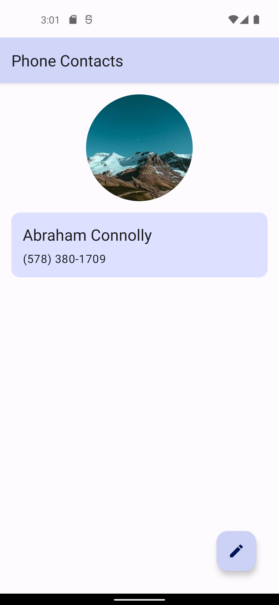
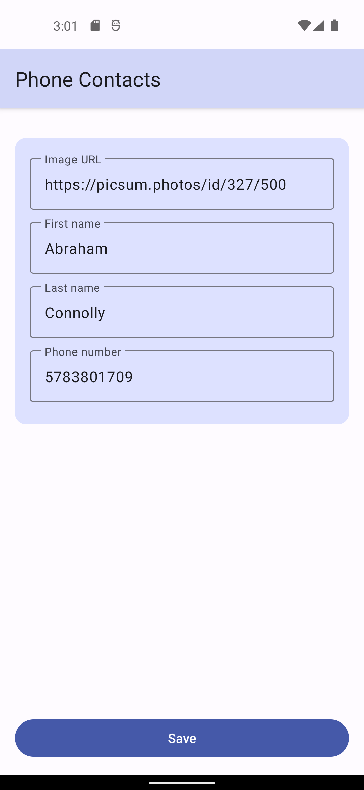
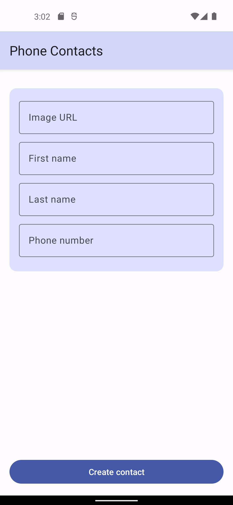

# aston-training
Projects for internship at the Aston company.

The Phone Contacts application has four screens. Contacts come from a predefined database.

This project uses MVVM pattern, Dagger 2, Room, LiveData, shared ViewModel, Coroutines, Navigation Components, and View Binding.

   
