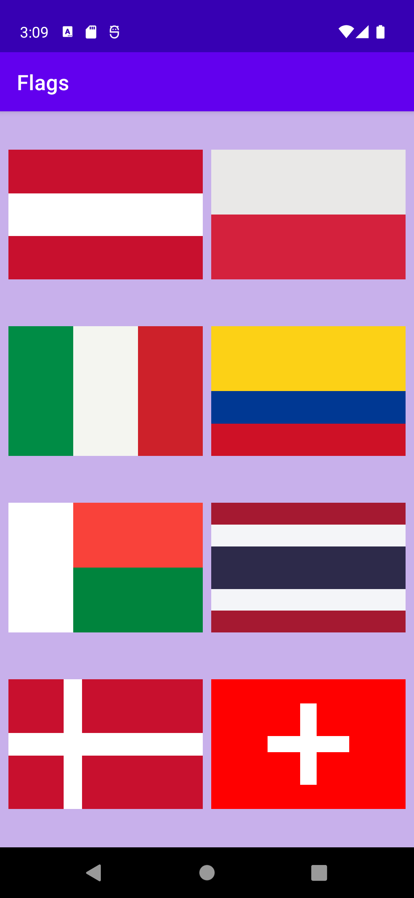
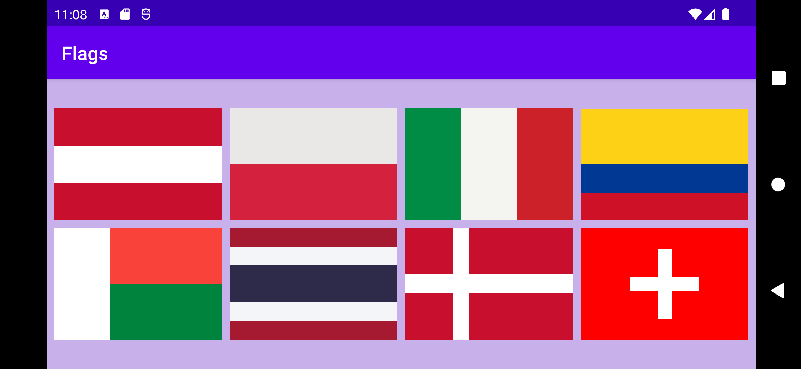

# aston-training
Projects for internship at the Aston company.

Flags of 8 countries (Austria, Poland, Italy, Colombia, Madagascar, Thailand, Denmark, Switzerland) which are rendered using only standard containers such as Frame Layout, Linear Layout and Constraint Layout.  

  

