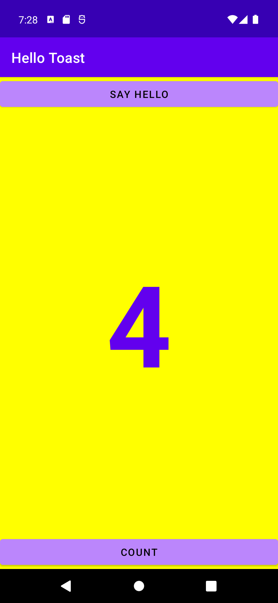
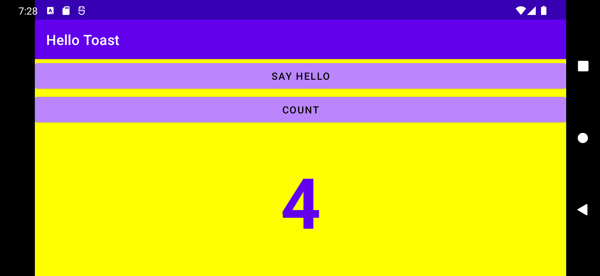

# aston-training
Projects for internship at the Aston company.

The Hello Toast app with two buttons.

The "SAY HELLO" button starts the second activity with the "Hello!" message and the current count number.  
The "COUNT" button increases the current count number by 1.

  

