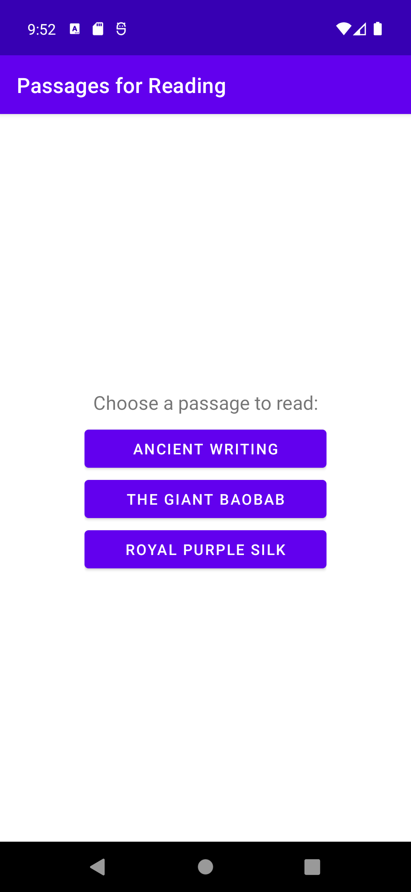
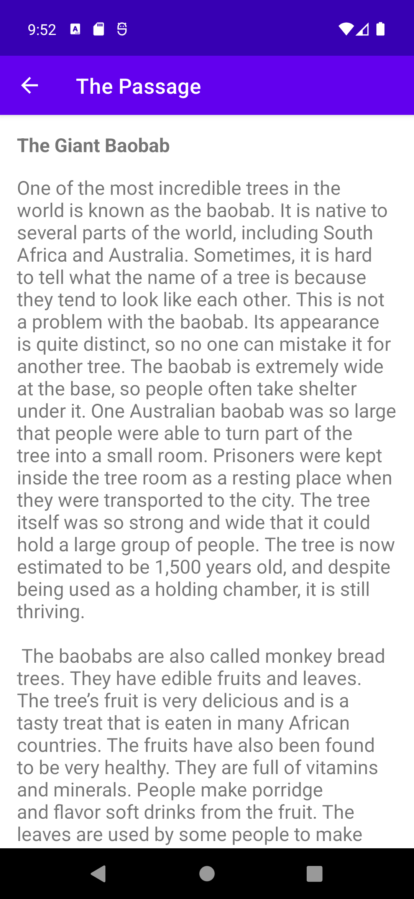

# aston-training
Projects for internship at the Aston company.

An example application with two Activities.

The main activity contains three buttons with the titles of the reading passages. Pressing one of the buttons starts the second activity with the selected passage.  
The second activity displays the selected passage.

  

