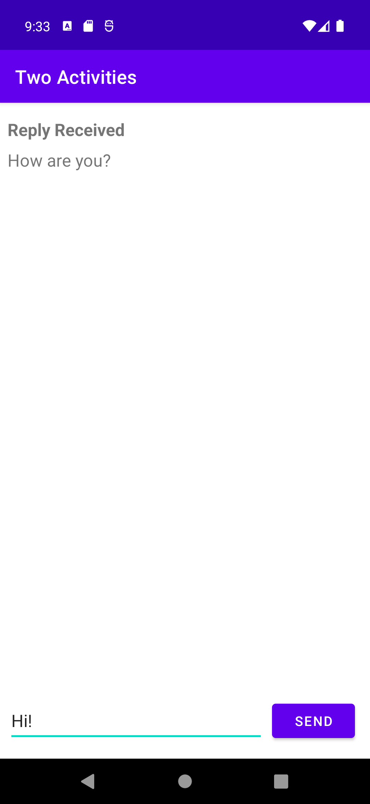

# aston-training
Projects for internship at the Aston company.

An example application with two Activities.

The main activity sends a message from the user to the second activity. It displays the reply message if it was recieved from the second activity.  
The second activity displays the recieved message from the main activity and sends the reply message from the user to the main activity.

  

