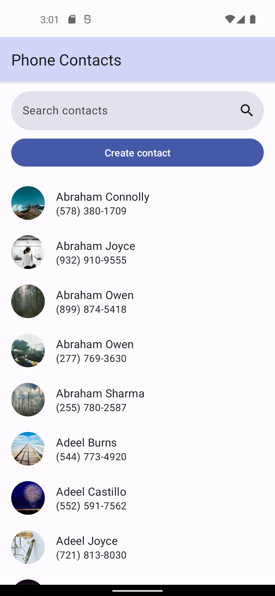

# aston-training
Projects for internship at the Aston company.

A Contact application with 4 screens. Contacts comes from a predefined database.

This project uses MVVM pattern, Dagger 2, Room, LiveData, shared ViewModel, Coroutines, Navigation Components, View Binding.

