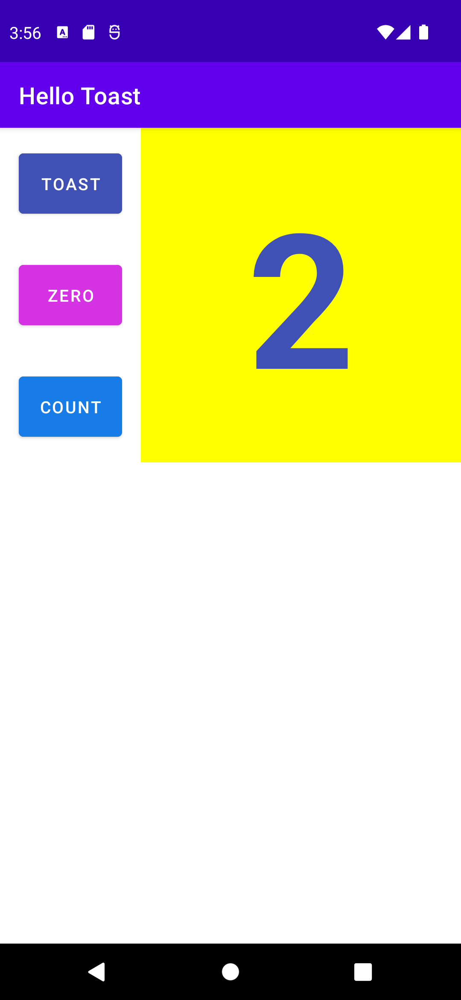

# aston-training
Projects for internship at the Aston company.

The Hello Toast app with three buttons.

The "TOAST" button shows the Toast message.  
The "ZERO" button sets the current count number to 0. The button color is set to gray when the count number is 0.  
The "COUNT" button increases the current count number by 1. The button color changes for odd and even numbers.

